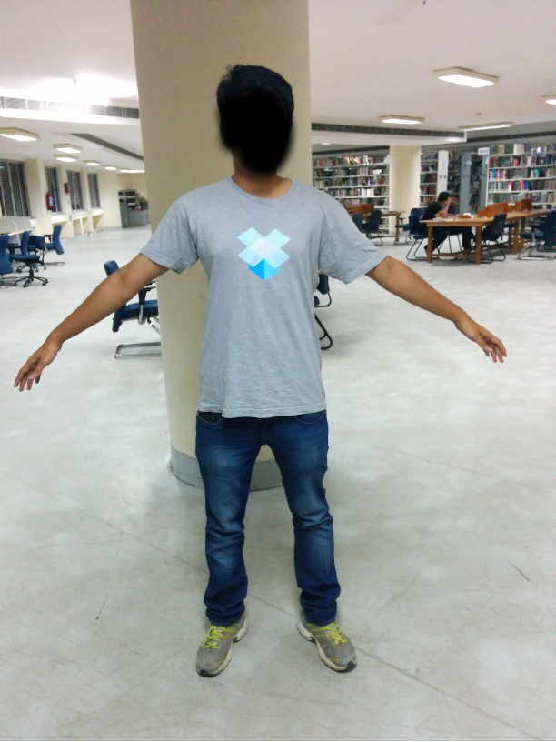
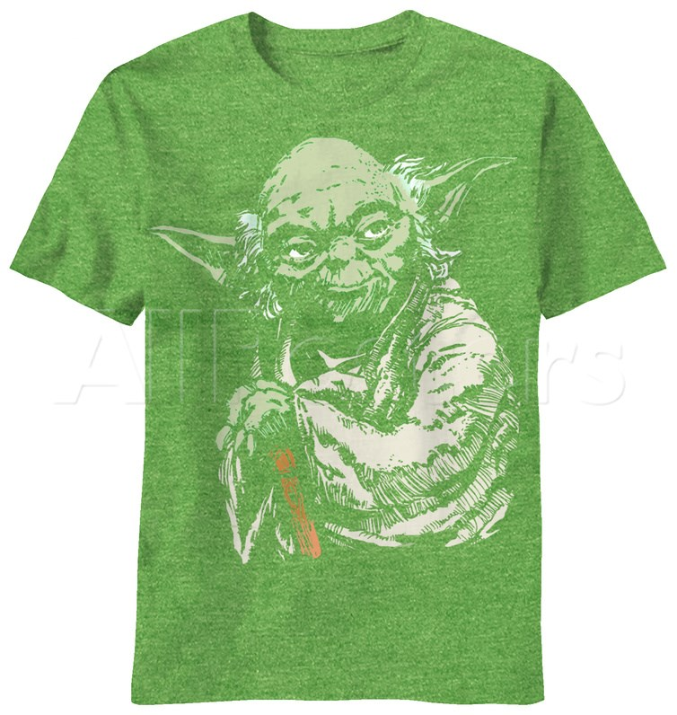
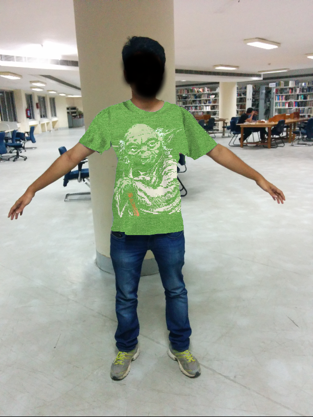
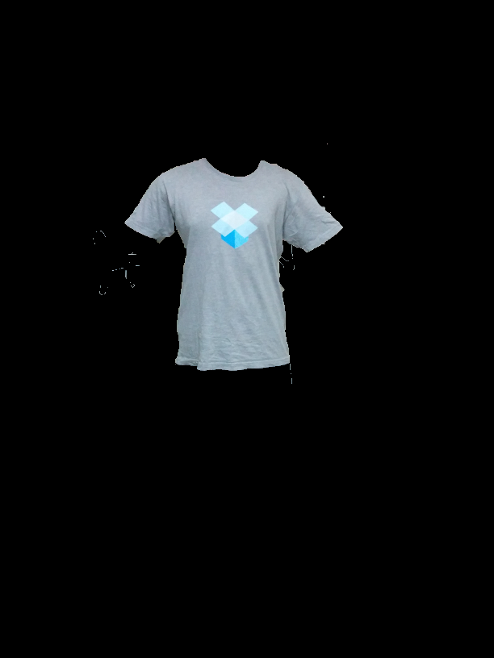

## Marooner - A virtual trial room

This is a prototype for a virtual trial room, implemented entirely in python.
For a user image like this



And an apparel image like this



It gives an output liek this



### Requirements

The code requires `python 2.7`, `opencv` and `numpy` to run.

### Usage

There are certain limitations to the kind of user images that the code can process. The underlying assumption while designing the code was that there will be a gap between the arms and torso in the user image, and that the legs would be split. Also, it's assumed that the apparel images have a clear backgroun, like the one shown in exmaple above

For extracting the outline of the topwear worn by the user from the user image, we used grabcut foreground segmentation, specifically the code sample provided by opencv [here](https://github.com/opencv/opencv/blob/master/samples/python2/grabcut.py).

To fit a tshirt on an user image, use the `topWearWrapper.py` script. To execute 

```
 $ python topWearWrapper.py [path to user image] [path to apparel image] 0
```

On passing the third argument as `0`, the code will create a new window with the user image titled as `input` and another window with completely black image as `output`. Follow the instructions on the terminal to extract the outline of the topwear worn by the user. The sample output for the input image above looks like this



Once, this kind of outline is extracted press `s` to save the output. After that the code will do the rest of the fitting automatically. Once, the grabcut output is saved, to try other apparels without having to extract the grabcut output each time, just pass the third parameter to `topWearWrapper.py` as `1`. The code will automatically use the file named `grabcutOutput.png` from the `debug` folder as grabcut output. If `debug` folder is not present, the code will automatically create it.

To fit a jeans or a trouser, use the `bottomWearWrapper.py` script. It's usage is similar to the top wear script. The grabcut output for bottom wear for the above input image looks like this


To find more apparel images, we have uploaded some of them [here](https://drive.google.com/drive/folders/0BwTk1GMeQRkQS2JHSkZyMEpnc0k?usp=sharing). 


